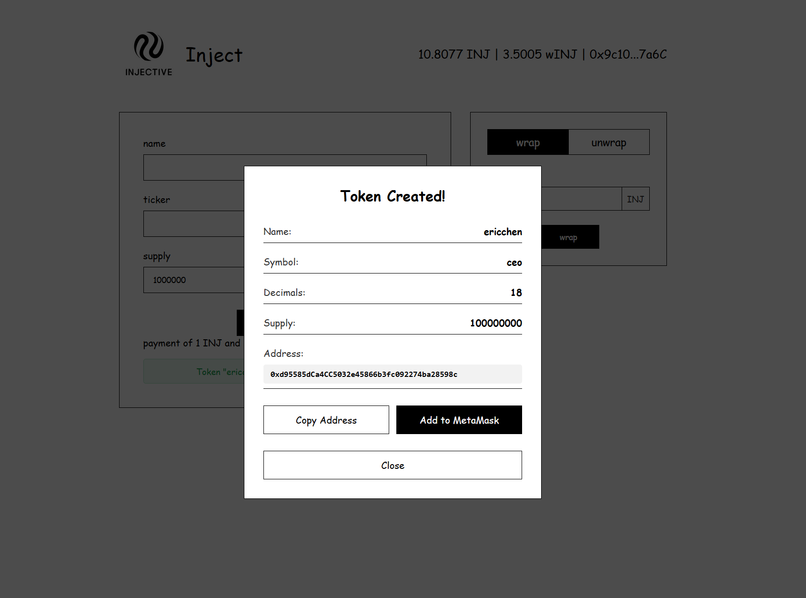

# 🏭 inject.fun - Injective Token Launcher

A decentralized token creation platform built on the Injective EVM testnet, allowing users to easily create and deploy custom ERC20 tokens with a sleek, user-friendly interface.



## 📋 Table of Contents

- [Overview](#-overview)
- [Features](#-features)
- [Architecture](#️-architecture)
- [Tech Stack](#️-tech-stack)
- [Prerequisites](#-prerequisites)
- [Installation](#-installation)
- [Usage](#-usage)
- [Smart Contracts](#-smart-contracts)
- [Project Structure](#-project-structure)

## 🌟 Overview

inject.fun is a comprehensive token factory application that demonstrates seamless token creation on the Injective EVM. Users can create custom ERC20 tokens, manage token ownership, and utilize wrapped INJ tokens for ecosystem integration. The application also includes functionality for wrapping/unwrapping INJ tokens and adding newly created tokens to MetaMask.

## ✨ Features

### Core Functionality

- 🪙 **Custom Token Creation**: Deploy ERC20 tokens with configurable parameters
- 🔄 **Wrap/Unwrap INJ**: Convert between native INJ and wINJ tokens
- 🔥 **Mint & Burn**: Token owners can mint additional supply or burn tokens
- 💼 **Ownership Management**: Transfer token ownership to other addresses
- 🔐 **MetaMask Integration**: Seamless wallet connection and transaction signing

### User Experience

- 🎨 Modern black & white theme with intuitive UI
- ⚡ Real-time INJ and wINJ balance updates
- 📱 Responsive design for desktop and mobile
- 🔔 Transaction status notifications with explorer links
- 🪙 One-click token addition to MetaMask

## 🏗️ Architecture

The project consists of three main components:

1. **Smart Contracts**: TokenFactory, MintableToken, and Bank module integration
2. **Frontend** (React + TypeScript): User interface for token creation and management
3. **Deployment Scripts**: Hardhat scripts for deploying and testing contracts

### How It Works

```text
User Wallet → Wrap INJ → Approve Fees → Create Token → Register with Bank → Add to MetaMask
```

1. User connects MetaMask wallet to Injective EVM testnet
2. User wraps INJ to get wINJ for the creation fee
3. User approves 1 wINJ + 1 INJ for token creation
4. TokenFactory deploys a new MintableToken contract
5. Token is automatically registered with Injective's bank module
6. User can add the new token to MetaMask and manage it

## 🛠️ Tech Stack

### Smart Contracts

- **Solidity** ^0.8.20
- **Hardhat** - Development environment
- **OpenZeppelin** contracts for secure ERC20 implementation

### Frontend

- **React** 19.2.0
- **TypeScript** 5.9.3
- **Vite** 7.2.4
- **Ethers.js** 6.16.0

### Network

- **Injective EVM Testnet**
- Chain ID: `0x59f` (1439)
- RPC: `https://k8s.testnet.json-rpc.injective.network/`

## 📦 Prerequisites

Before you begin, ensure you have the following installed:

- **Node.js** (v16 or higher)
- **npm** or **yarn**
- **MetaMask** browser extension
- **Git**

You'll also need:

- Test INJ tokens from the [Injective Testnet Faucet](https://testnet.faucet.injective.network/)
- At least 2 INJ (1 wINJ + 1 INJ) for token creation fees

## 🚀 Installation

### 1. Clone the Repository

```bash
git clone https://github.com/yourusername/inject-fun.git
cd injective-tutorials
```

### 2. Install Contract Dependencies

```bash
cd mts-token
npm install
```

### 3. Install Frontend Dependencies

```bash
cd ../mts-frontend
npm install
```

### 4. Configure Environment Variables

Create a `.env` file in the `mts-token` directory:

```env
PRIVATE_KEY=your_wallet_private_key_here
INJECTIVE_RPC=https://k8s.testnet.json-rpc.injective.network/
```

> ⚠️ **Security Warning**: Never commit your `.env` file or share your private key!

## 💻 Usage

### Compile Smart Contracts

```bash
cd mts-token
npx hardhat compile
```

### Deploy to Injective Testnet

```bash
npx hardhat run script/deploy.js --network inj_testnet
```

After deployment, note the contract addresses displayed in the console.

### Run Frontend Development Server

```bash
cd mts-frontend
npm run dev
```

The application will be available at `http://localhost:5173`

### Connect Your Wallet

1. Open the app in your browser
2. Click "Connect Wallet" in the top right
3. Approve the MetaMask connection
4. Switch to Injective EVM testnet (automatic prompt)

### Create a Token

**Step 1: Get wINJ**

1. Navigate to the Wrap/Unwrap section
2. Enter amount of INJ to wrap (minimum 1 INJ)
3. Click "Wrap" and confirm transaction

**Step 2: Create Your Token**

1. Fill in token details:
   - **Name**: Full token name (e.g., "My Awesome Token")
   - **Ticker**: Token symbol (e.g., "MAT")
   - **Supply**: Initial token supply (e.g., 1000000)
   - **Decimal**: Token decimals (typically 18)
2. Click "create token"
3. Approve wINJ spending in MetaMask
4. Confirm token creation transaction (1 wINJ + 1 INJ)
5. Wait for confirmation

**Step 3: Add Token to MetaMask**

1. A modal will appear with your new token address
2. Click to automatically add the token to MetaMask
3. Your tokens will now be visible in your wallet

### Wrap/Unwrap INJ

**Wrap:**
- Enter amount of INJ to wrap
- Click "Wrap" and confirm transaction
- Receive wINJ in your wallet

**Unwrap:**
- Enter amount of wINJ to unwrap
- Click "Unwrap" and confirm transaction
- Receive INJ in your wallet

## 📂 Project Structure

```text
injective-tutorials/
├── mts-token/
│   ├── contracts/
│   │   ├── TokenFactory.sol       # Factory contract for creating tokens
│   │   ├── MintableToken.sol      # ERC20 token with mint/burn capabilities
│   │   ├── BankERC20.sol          # Injective bank module integration
│   │   └── Bank.sol               # Bank module interface
│   ├── script/
│   │   └── deploy.js              # Deployment script
│   ├── hardhat.config.js          # Hardhat configuration
│   └── package.json
├── mts-frontend/
│   ├── src/
│   │   ├── App.tsx                # Main application component
│   │   ├── App.css                # Styling
│   │   └── assets/                # Static assets
│   ├── vite.config.ts             # Vite configuration
│   └── package.json
└── README.md                       # This file
```

## 🔍 Key Files

- **`mts-token/contracts/TokenFactory.sol`**: The factory contract that deploys new tokens
- **`mts-token/contracts/MintableToken.sol`**: The ERC20 token template with mint/burn
- **`mts-frontend/src/App.tsx`**: React application with token creation interface
- **`mts-token/script/deploy.js`**: Contract deployment script
- **`mts-token/hardhat.config.js`**: Network and compiler configuration

## 🧪 Testing

Run contract tests:

```bash
cd mts-token
npx hardhat test
```

## 🌐 Network Configuration

### Injective EVM Testnet

- **Chain ID**: 1439 (0x59f)
- **RPC URL**: https://k8s.testnet.json-rpc.injective.network/
- **Block Explorer**: https://testnet.blockscout.injective.network/blocks
- **Faucet**: https://testnet.faucet.injective.network/


**Built with ❤️ for the Injective ecosystem**